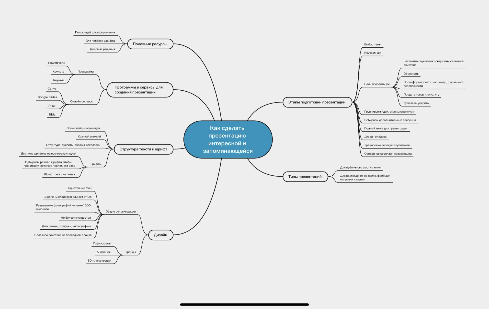

# Как сделать презентацию крутой и запоминающейся

## Этапы создания презентации

Мы рассказали о последовательности подготовки презентации, которая поможет вам системно подойти к вопросу.

## Сформулируйте тему

Один из самых важных этапов в подготовке. Сформулируйте тему так, чтобы она не была слишком широкой. Иначе вы будете говорить обо всем и ни о чем. К тому же время презентации ограничено, и много аспектов охватить не получится.

## Определите цель

Как вы поймете, что презентация прошла успешно? По каким признакам и параметрам? Достижение цели — один из них.

Вот несколько распространенных вариантов цели презентации:

    заставить аудиторию совершить желаемое действие;
    объяснить сложную для понимания информацию;
    проинформировать о правилах безопасности;
    продать товар или услугу;
    доказать правильность гипотезы;
    убедить в ценности идеи.

Определите цель презентации на старте. В соответствии с ней готовьте материалы для выступления или видео.

## Изучите аудиторию

Задайте себе вопросы:

    Кто мой слушатель?
    Чем он интересуется?
    Какие вопросы, связанные с темой презентации, его волнуют?
    Что именно он хочет от меня услышать в данный момент?
    Как эта информация поможет ему в жизни?

Чтобы не делать ложных предположений, можно напрямую обратиться к аудитории. Например, провести опрос в релевантных сообществах в соцсетях или через email рассылку, пообщаться лично с теми, для кого планируете проводить презентацию.Знание целевой аудитории поможет в подборе материалов. Вы поймете, какой ракурс подобрать и какую часть информации давать, чтобы не было слишком поверхностно или очень глубоко.

## Составьте структуру презентации

Запишите все идеи, связанные с темой. Выделите ключевые тезисы. Определите последовательность подачи информации — каким путем вы приведете слушателя к поставленной ранее цели.

Для простой и недлинной презентации достаточно составить план в виде списка. Если объем информации для представления обширный и трудно укладывается в голове — нарисуйте майнд-карту. С ее помощью легко сортировать идеи и построить структуру.

Майнд-карта для презентации по теме статьи выглядела бы так:

## Соберите дополнительные данные

Чтобы подкрепить идеи на слайдах, необходимы дополнительные сведения: факты, аргументы, социальные доказательства.

Какие данные пригодятся:

    последние новости и исследования;
    статистика;
    точки зрения экспертов в этой области;
    отзывы;
    истории и кейсы.

## Подготовьте текст

Любая презентация состоит из трех частей:

    Вступление: Представляемся и коротко рассказываем, о чем пойдет речь, и как эта информация будет полезна аудитории.
    Основная часть: Раскрываем тему. Приводим факты, кейсы и доказательства, подтверждающие основные положения презентации.
    Итоги и выводы: Возвращаемся к своему исходному утверждению и даем аудитории несколько ключевых выводов о том, как применить знания на практике.

В статье мы рассматриваем презентации двух видов:

    Публичное выступление, которое сопровождается показом слайдов.
    Видео, PDF или другой формат файла, который отправляется клиенту или размещается на сайте.

Для выступления детально пропишите речь. Продумайте варианты сценария: как может меняться последовательность изложения материала в зависимости от вопросов и реакций слушателей.

Удержать внимание аудитории и оживить презентацию помогут истории, анекдоты и примеры из личного опыта. Заранее найдите подходящие и законспектируйте, чтобы оперативно повторить перед мероприятием.

Слайды для публичной презентации должны содержать минимум текста. Хорошо, когда текст дополняет выступление и отражает только главные мысли.

Для заголовков на слайдах используйте тезисы из составленной ранее структуры. Остальные данные старайтесь передать сжато, с помощью пунктов списка, в виде иллюстраций, фото, диаграмм, инфографики.

Для презентации, которую необходимо отправить клиенту или разместить на сайте, текстовое наполнение слайдов делаем более подробным. В данном случае это фактически книга с поясняющими иллюстрациями. Все, что вы хотите сказать, вы передаете текстом и усиливаете картинками для простоты понимания.

## Проработайте дизайн слайдов

Задача слайдов помогать в объяснении сложной информации, акцентировать детали, которые нужно донести до публики. И в то же время не отвлекать внимание от выступающего или от текста по теме слишком ярким оформлением. Найдите золотую середину.

Если у вас нет профессионального дизайнера, то можно воспользоваться программами, сервисами и приложениями для создания презентаций. Такими, как Power Point, Canva, Keynote и другими. Об их особенностях читайте далее в статье.

## Проведите предварительную тренировку

Когда слайды и сценарий готовы, время отрепетировать выступление. Обратите внимание на части текста, которые вам сложно прочитать. Отредактируйте их.

Некоторые люди предпочитают готовиться самостоятельно. Но иногда хорошо провести презентацию для друзей или коллег. Тогда вы будете уверены, что материал понятен слушателю.
