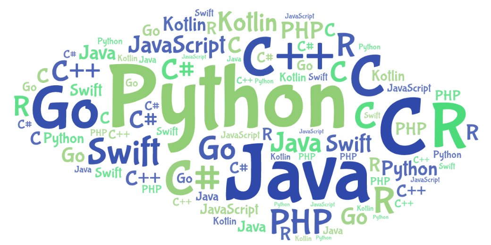

Где применяется научное программирование?   
Научное программирование лежит в основе любого современного глобального исследования. Все передовые технологии — от квантовых компьютеров до космических программ — были бы невозможны без специалистов в области научного программирования, способных предоставить ученым надежный и точный инструмент для совершения открытий.
Ряд отраслей науки непосредственно зависят от уровня развития научного программирования. Так, своего исполнения ждут беспилотный транспорт, «умные» системы управления городским и сельским хозяйством, фондовыми биржами; ждут робототехника, генная инженерия, искусственный интеллект, превосходящий возможности человека.

Языки научного программирования
В различных областях могут применяться разные существующие языки программирования, но в этой статье я хочу поговорить о трех.

1. R

R, который является прямым потомком старшего языка программирования S, был выпущен в далеком 1995 году и с тех пор становится все совершеннее. Написанный на таких языках как C и Fortran данный проект сегодня поддерживается Фондом языка R для статистических вычислений (R Foundation for Statistical Computing). Отличный набор высококачественных предметно-ориентированных пакетов с открытым исходным кодом. R имеет в своем распоряжении пакеты практически для любого количественного и статистического применения, которое можно только себе представить. Сюда входят нейронные сети, нелинейная регрессия, филогенетика, построение сложных диаграмм, графиков и многое-многое другое. Вместе с базовой установкой в довесок нам предоставляется возможность установки обширных встроенных функций и методов. Кроме того, R прекрасно обрабатывает данные матричной алгебры.R – мощный язык, который отличается наличием огромного выбора приложений для сбора статистических данных и визуализации данных, а тот факт, что он является ЯП с открытым исходным кодом, позволяет ему собрать большое количество поклонников среди разработчиков. Именно благодаря своей эффективности для первоначальных целей этому языку программирования удалось достичь широкой популярности.

2. Python

Python один из самых популярных языков программирования на данный момент. Он имеет простой синтаксис и множество разнообразных библиотек и фреймворков, которые помогут в достижении нужной задачи.
Python является хорошим вариантом для целей науки о данных (data science), и это утверждение справедливо как для начального, так и для продвинутого уровней работы в данной области. Большая часть науки о данных сосредоточена вокруг процесса ETL (извлечение-преобразование-загрузка). Эта особенность делает Python идеально подходящим для таких целей языком программирования.

3. Julia

Выпущенный чуть более 5 лет назад, Julia произвела впечатление на мир вычислительных методов. Язык добился такой популярности благодаря тому, что несколько крупных организаций, включая некоторые в финансовой отрасли, почти сразу начали использовать его для своих целей. Julia – это скомпилированный язык JIT («точно в срок»), благодаря которому удается достичь хорошей производительности. Этот язык является достаточно простым, он предусматривает возможности динамической типизации и сценариев интерпретируемого языка, такого как Python. Julia был предназначен для проведения численного анализа, он также может рассматриваться в качестве языка программирования общего назначения. Конечно, этот язык имеет свои недостатки, основным из которых является его молодость. У этого языка пока недостаточно пакетов программ, однако через несколько лет он сможет потягаться со своими основными конкурентами.

Научное программирование и языки, на которых с ним можно работать, приобретают небывалую популярность из-за прогресса, который идет в нашем обществе. Оно позволяет ученым развивать технологии и превращать наш мир в “мир будущего”.
